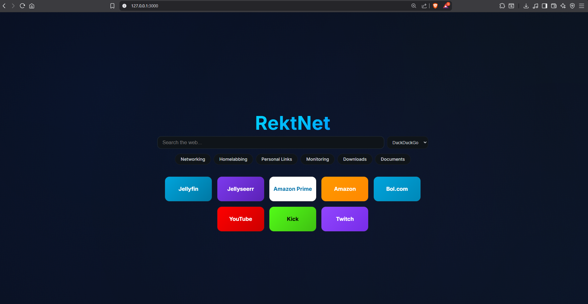

# RektNet - Custom Network Search Engine

A clean, Google-like search engine interface designed for personal network use with a modern dark theme and animated background. Features include search shortcuts, dropdown navigation menus, and quick access service cards.



## Features

- **Clean Search Interface**: Google-inspired design with DuckDuckGo as the default search engine
- **Search Shortcuts**: Quick access to specific search engines using shortcuts (e.g., `!y` for YouTube, `!w` for Wikipedia)
- **Animated Background**: Dynamic gradient mesh with animated grid overlay
- **Dropdown Navigation**: Hover-activated dropdown menus for organized service access
- **Service Cards**: Quick access cards for frequently used services
- **Easter Egg**: Hidden interactive logo animation (hover for 5 seconds to discover)
- **Responsive Design**: Works on desktop and mobile devices
- **Dark Theme**: Stealthy dark design with blue accents


## Installation

1. Clone the repository:
```bash
git clone https://github.com/rektbyfaith/Tryhard-Homepage.git
cd Tryhard-Homepage
```

2. Install dependencies:
```bash
npm install
```

3. Start the server:
```bash
npm start
```

4. Open your browser and navigate to `http://localhost:3000`

## Configuration

### Customizing Services

Edit `public/js/app.js` to customize:

- **Service Cards**: Modify the `services` array to add/remove service cards
- **Dropdown Menus**: Update the `dropdownContent` object to customize dropdown options
- **Default Buttons**: Change the `defaultButtons` array to modify the navigation buttons

### Customizing URLs

Replace placeholder URLs and IPs in `public/js/app.js`:

- Update `192.168.100.100` and `192.168.100.101` with your network IPs
- Replace `example.com` domains with your actual domains
- Update Discord links and other personal links

### Styling

Customize the appearance in `public/css/style.css`:

- Color scheme: Modify CSS variables in `:root`
- Background animation: Adjust gradient and grid settings
- Card sizes: Modify `.service-card` dimensions
- Logo styling: Update `.logo` classes

## Project Structure

```
rektnet/
├── public/
│   ├── css/
│   │   └── style.css          # Main stylesheet
│   ├── js/
│   │   └── app.js            # Application logic
│   └── index.html             # Main HTML file
├── server.js                  # Express server
├── package.json               # Dependencies
└── README.md                  # This file
```

## Search Shortcuts

- `!g` - Google Search
- `!i` - Google Images
- `!m` - IMDb
- `!u` - Urban Dictionary
- `!w` - Wikipedia
- `!y` - YouTube

## Technologies Used

- **Frontend**: HTML5, CSS3, JavaScript (Vanilla)
- **Backend**: Node.js, Express
- **Styling**: Custom CSS with animations
- **Icons**: Font Awesome 6.4.0
- **Fonts**: Google Fonts (Inter)

## Browser Support

- Chrome/Edge (latest)
- Firefox (latest)
- Safari (latest)
- Opera (latest)

## License
This project is open source and available under the [MIT License](LICENSE).
## Contributing
Contributions are welcome! Please feel free to submit a Pull Request.